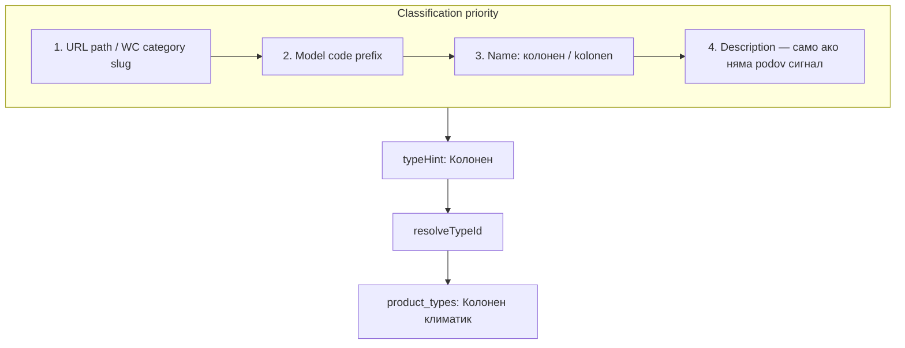

# Добавяне на тип „Колонен климатик“ (supplier-aware план)

## Архитектура (без промяна)

Типовете са референции в `product_types` + UI фасет `categories` + mapping `category_types`. Импортът попълва:

- `products`: name, model_code, description, price, price_with_mount, brand_id, **type_id**, category_id (Bulclima/Condex/Bittel), supplier_id, source_url, slug
- `product_specs`: BTU, kW, SEER/SCOP, energy class, noise, dimensions, weights, refrigerant, wifi, warranty, coverage_m2
- `product_images`, `product_features`

Класификацията минава през `typeHint` → `resolveTypeId()` (substring match с `product_types.name`).

---

## Одит спрямо текущия код (без конфликти)

Прегледът показва, че **няма breaking промени** — всичко е additive. Публичният каталог и admin **не ползват hardcoded enum** за типове; работят data-driven през DB + 3 frontend/backend константи.

### Публичен каталог — как се виждат и филтрират

| Компонент | Файл | Как работи за `column` | Промяна нужна? |
|-----------|------|------------------------|----------------|
| Category chips | `CategoryChips.tsx` + `CATEGORIES` | Чипове от `CATEGORIES`; броячи от API | **Да** — нов chip + `Columns` icon |
| URL `?cat=column` | `CatalogPage.tsx` → `/api/products` | `cat` slug → `categories` + `category_types` + `CATEGORY_TYPE_FALLBACK` → `type_id` | **Да** — DB + fallback |
| Броячи в chips | `publicCatalogDedup.resolveCategoryTypeIds` | Обхожда `CATALOG_CATEGORY_SLUGS` | **Да** — добави `column` |
| Meta (цена, BTU, марки) | `/api/catalog/meta` | BTU/brand/energy — generic по specs; не по тип | **Не** |
| FilterSidebar | `FilterSidebar.tsx` | Марка, BTU (7–90), енергиен клас, features, цена | **Не** — колонните са 24/48/55 BTU, вече в `CATALOG_BTU_OPTIONS` |
| ActiveFilters | `ActiveFilters.tsx` | Показва brand/BTU/energy/features — не category chip label | **Не** |
| Dedup / similar | `publicCatalogDedup`, similar route | Dedup по brand+model+**type_id** | **Не** — колонните са отделен bucket |
| Visibility | `publicProductVisibility.ts` | Само `show_in_public_catalog === true` | **Оперативно** — виж по-долу |

**Заключение:** След миграция + 3 константи + parser fixes, филтрите (BTU, марка, клас, features, цена, търсене) работят **идентично** на другите типове. Единственото UI добавяне е chip „Колонни климатици“.

### Admin panel — продукти

| Компонент | Как работи | Промяна нужна? |
|-----------|------------|----------------|
| Dropdown „Тип“ | `/api/admin/meta/product-types` — всички редове от `product_types` | **Не** — автоматично след миграция |
| Филтър „Тип: всички“ | `?typeId=` в admin products API | **Не** |
| Колона „Тип“ в таблица | `product_types.name` join | **Не** |
| ProductForm | `typeId` select от същия API | **Не** |
| BTU chip филтри | `CATALOG_BTU_OPTIONS` (споделен с публичния) | **Не** |
| `category_id` на продукта | Задава се от import sync; admin form **не** редактира facet slug | **Не** — публичният `?cat=` ползва `type_id`, не `products.category_id` |

### Открити пропуски (добавени в плана)

1. **`CategoryChips` icon map** — `ceiling` в DB/seed е `ArrowUpFromLine`, но `ICON_MAP` ползва `Briefcase` (съществуващ bug). При добавяне на `Columns` → fix и двата icon-а.
2. **`show_in_public_catalog`** — всички sync-и създават продукти с `show_in_public_catalog: false`. Без ръчно включване в admin **няма да се виждат** в публичния каталог (същото като всички импортирани продукти днес). Smoke test трябва да включва toggle „В публичен каталог“.
3. **Ред на деплой:** миграция **преди** sync — иначе `resolveTypeId("Колонен")` пада на default „Стенен“.
4. **`classifyBittelItem.ts`** — `CLIMATE_LISTING_PATH` не включва `/kolonni-klimatici`; работи чрез `KLIMA_NAME` („колонен климатик“), но за надеждност → добави path.
5. **GuidedBuyingWizard** — „Търговско/Офис“ **не** филтрира към column/cassette (legacy gap, не блокер за каталог). Out of scope освен ако поискаш.
6. **Re-classify стари записи** — ако някой kolonen продукт вече е import-нат като „Стенен“, re-sync **не** сменя `type_id` на update (само create). Провери admin → филтър + ръчна корекция или one-off SQL.

---

## Критичен капан: колонен ≠ подов

**Всички четiri доставчика** описват колонните с текст „подов монтаж“, „подови модели“, „на пода“ — но това е **колонен** тип, не `Подов климатик` (конзолен SRF/SFZ).

| Доставчик | Колонен сигнал | Грешно сигнал (floor) |
|-----------|----------------|------------------------|
| Bulclima | path `kolonni-klimatici`, name „колонен“ | path `podovi-klimatici`, hint „подов тип“ |
| Condex | path `kolonni-modeli`, model **FDF**/FDC | path `srf`/`podov`, model SRF |
| Climacom | slug `kolonen-tip`, `klimatik-kolonen-tip-*`, name „Колонен“, model **PSA-M** | slug `podov`, SFZ-M скрит монтаж |
| Bittel | path `/kolonni-klimatici`, name „Колонен“, models GVH/FVA | „подов тип“ в name |

**Правило за всички парсери:** `колон` / `kolonen` / `fdf` / `psa-m` / `gvh` / `fva` / `wsm` → **преди** regex за `подов`.

---

## Конвенции (DB + UI)

| Поле | Стойност |
|------|----------|
| `product_types.name` | `Колонен климатик` |
| Category slug | `column` |
| UI label | `Колонни климатици` |
| Import `typeHint` | `Колонен` (Climacom: `колон`) |
| Icon | `Columns` (lucide) |

---

## Стъпка 1: Supabase миграция

Файл: [`backend/supabase/migrations/0093_column_ac_type.sql`](backend/supabase/migrations/0093_column_ac_type.sql)

- INSERT `product_types` → `Колонен климатик`
- INSERT `categories` → slug `column`, sort_order **45** (между floor и ceiling)
- INSERT `category_types`
- Обнови [`0005_seed_minimal.sql`](backend/supabase/migrations/0005_seed_minimal.sql)

---

## Стъпка 2: Константи (frontend + backend)

- [`backend/lib/catalog/publicCatalogDedup.ts`](backend/lib/catalog/publicCatalogDedup.ts): `column: ["Колонен климатик"]`, `CATALOG_CATEGORY_SLUGS`
- [`frontend/data/productService.ts`](frontend/data/productService.ts): `CATEGORIES` + `resolveProductCategory` (`колон` → Търговски)
- [`frontend/components/catalog/CategoryChips.tsx`](frontend/components/catalog/CategoryChips.tsx): `Columns` icon + fix `ceiling` → `ArrowUpFromLine` в `ICON_MAP` (сега е `Briefcase`, mismatch с seed)

---

## Стъпка 3: Импорт по доставчик (детайлен одит)

### 3.1 Bulclima — [`parseBulclimaHtml.ts`](backend/lib/import/bulclima/parseBulclimaHtml.ts)

**Сайт:** [bulclima.com/.../kolonni-klimatici](https://bulclima.com/products/klimatici/kolonni-klimatici) — **6 продукта** (Kaisai, Williams), BTU 24/48/55.

**HTML структура:** същата като стенни/подови — `parseBulclimaProductPage` вече извлича name, price, specs table, gallery, breadcrumbs. Williams ползва 3-кол. таблица (коментирано на ред ~393) — **без нов parser**.

**Примерни продукти за smoke test:**
- Williams WSM-24HRFN8 (~1650 €)
- Kaisai KFS-48HRG32X/KOE30U-48HFN32X (~2940 €)

**Промени:**

| Функция | Промяна |
|---------|---------|
| `categorySlugFromKlimaticiPath` | `if (p.includes("kolon")) return "column"` — **преди** `podovi` |
| `typeHintFromProductText` | `/колон/i` → `"Колонен"` — **преди** `/подов/` |
| `KLIMA_CATEGORY_PRIORITY` | `"column"` след `"floor"`: `["floor","column","cassette","ceiling","multi","wall"]` |
| `typeHintFromCategorySlug` | `column` → `"Колонен"` |
| `resolveBulclimaProductClassification` fallback | `typeHint === "Колонен"` → `categorySlug = "column"` |
| `isAllowedBulclimaCategoryPath` | **Премахни `kolonni`** от blocklist; добави `/kolon/i` в `ALLOWED_CATEGORY_PATTERNS` |
| `BULCLIMA_DEFAULT_SYNC_LISTING_URLS` | + `https://bulclima.com/products/klimatici/kolonni-klimatici` |
| `listingCategorySpecificity` | + `p.includes("kolonni")` → specificity 3 |

**Полета след sync:** всички стандартни Bulclima полета — mount addon, specs appendix, до 16 images. `category_id` → `column` via slug map в sync.

---

### 3.2 Condex — [`parseCondexProduct.ts`](backend/lib/import/condex/parseCondexProduct.ts) + [`collectCondexProducts.ts`](backend/lib/import/condex/collectCondexProducts.ts)

**Сайт:** [condex.bg/products/kolonni-modeli/](https://condex.bg/products/kolonni-modeli/) — серия **FDF** (MHI), 7.1–14.0 kW, под **PAC** (не RAC hub).

**Product page пример:** [FDF 71 VH / FDC 71 VNX-W](https://condex.bg/product-details/fdf-71-vh-fdc-71-vnx-w/)
- Categories в HTML: `Колонни модели FDF`, `За търговски обекти (PAC)`
- Spec table: охладителен/отоплителен kW, SEER/SCOP, шум (multi-value dB), размери в/д/ш, R32
- Цена задължителна (sync skip без price)

**Проблем днес:** `CONDEX_DEFAULT_SYNC_LISTING_URLS` = само 6 **стенни RAC** серии — kolonni **не се crawl-ва**. `categorySlugFromCondexPath` няма `fdf`/`kolonni` → FDF продуктите биха станали `wall` или `floor` (ако match-не „подов“ в описанието).

**Промени:**

| Функция | Промяна |
|---------|---------|
| `categorySlugFromCondexPath` | `if (p.includes("kolonni") \|\| p.includes("fdf")) return "column"` — **преди** `srf`/`podov` |
| `typeHintFromProductText` | `/\bfdf\b/i`, `/колон/i` → `"Колонен"` — **преди** `srf`/`подов` |
| `extractCondexModelCode` | Добави **FDF/FDC** kit pattern (dual name `FDF 71 VH / FDC 71 VNX-W`) |
| `KLIMA_CATEGORY_PRIORITY` + slug/hint helpers | като Bulclima |
| `resolveCondexProductClassification` fallback | `Колонен` → `column` |
| `CONDEX_DEFAULT_SYNC_LISTING_URLS` | + `https://condex.bg/products/kolonni-modeli/` |
| `listingCategorySpecificity` (collect) | + `kolonni`, `fdf` → 3 |

**EXCLUDED_LISTING_PATH:** `kolonni-modeli` **не** попада в exclusion — OK.

**Полета след sync:** пълен Condex spec extract + panel note ако „не включва панел“. Brand фиксиран MHI.

---

### 3.3 Climacom — [`parseClimacomProduct.ts`](backend/lib/import/climacom/parseClimacomProduct.ts) + [`collectClimacomProducts.ts`](backend/lib/import/climacom/collectClimacomProducts.ts)

**Сайт:** Mr.Slim → [kolonen-tip](https://climacom.com/produkt-kategoriya/profesionalna-klimatizaciq-mr-slim/kolonen-tip/) — **14 продукта** (7 Standard + 7 Power Inverter).

**WC API category slugs (verified):**
- `klimatik-kolonen-tip-psa-standard-inverter` (7)
- `klimatik-kolonen-tip-psa-power-inverter` (7)
- Parent filter: `?category=kolonen-tip` връща и двата

**Пример:** PSA-M71KA / PUZ-ZM71VHA — name „Колонен климатик …“, price от WC API, specs от HTML table на product page.

**Проблем днес:** `CLIMACOM_CLIMATE_CATEGORY_SLUGS` **няма** kolonen категории → 0 продукти. `resolveClimacomTypeHint` няма `kolonen` → fallback `стен`. Описанието казва „подови модели“ — опасно без slug priority.

**Промени:**

| Файл | Промяна |
|------|---------|
| `collectClimacomProducts.ts` | Добави в `CLIMACOM_CLIMATE_CATEGORY_SLUGS`: `"kolonen-tip"` (parent — покрива и двата subcat) |
| `resolveClimacomTypeHint` | Slug: `kolonen`, `kolonen-tip` → `"колон"`; Name: `/колон/i`, `/\bpsa-m/i` → `"колон"` — **преди** `podov` |
| Name patterns | Не match-вай `podov` ако name/slug вече е kolonen |

**Model code:** от name `PSA-M71KA / PUZ-ZM71VHA` — existing `extractModelCode` трябва да работи; при нужда добави PSA/PUZ kit regex.

**Полета:** WC price + HTML specs table (kW, SEER/SCOP, dimensions, noise). Climacom **не задава** `category_id` — достатъчен е правилен `type_id`.

**Забележка:** `podov-klimatik-za-skrit-montaj` (SFZ-M) остава `floor` — различен slug.

---

### 3.4 Bittel — [`parseBittelProduct.ts`](backend/lib/import/bittel/parseBittelProduct.ts) + [`collectBittelProducts.ts`](backend/lib/import/bittel/collectBittelProducts.ts)

**Сайт:** [bittel.bg/c/klimatici/profesionalni/kolonni-klimatici](https://www.bittel.bg/c/klimatici/profesionalni/kolonni-klimatici) — Daikin FVA, Gree GVH, AUX, Nippon и др.

**Product page пример:** [Gree GVH48ALXH-K6DNC7A](https://www.bittel.bg/kolonen-klimatik-gree-gvh48-alxh-k6-dnc7-a)
- Пълен spec tab: BTU 48000, kW min/nom/max, SEER/SCOP, energy A+/A, Wi-Fi, warranty 24m, indoor/outdoor dims & weights, R32
- URL slug: `/kolonen-klimatik-*` (single-segment — crawl-compatible)

**Проблем днес:** `BITTEL_LISTING_ROOTS` = само invertorni + multisplit + aksesoari — **kolonni listing не се crawl-ва**. Classification default → `wall`.

**Промени:**

| Файл | Промяна |
|------|---------|
| `collectBittelProducts.ts` | + `{ url: ".../c/klimatici/profesionalni/kolonni-klimatici", path: "/c/klimatici/profesionalni/kolonni-klimatici" }` |
| `resolveBittelProductClassification` | `/kolon/i` в name+path → `{ categorySlug: "column", typeHint: "Колонен" }` — след multi, **преди** podov и default wall |
| `syncBittelCatalog.ts` | `resolveBittelCategoryAndType` наследява промяната автоматично |
| `classifyBittelItem.ts` | + `/kolonni-klimatici` в `CLIMATE_LISTING_PATH` (robustness) |

**Model hints (optional boost):** `\bFVA\d`, `\bGVH\d`, `\bASF-H` в name → column ако path е kolonni.

**Полета:** пълен Bittel extract — всички specs, до 4 images, warranty.

---

## Стъпка 4: Smart Advisor / AI / SEO

- [`advisor-logic.ts`](frontend/components/sections/SmartAdvisor/advisor-logic.ts): `isCommercialType` + `calcInstallCost` (~250 € base за колонен)
- [`catalogToAIProducts.ts`](frontend/components/ai-assistant/data/catalogToAIProducts.ts): `'Колонен климатик': ['office', 'commercial']`
- [`backend/lib/seo/pages.ts`](backend/lib/seo/pages.ts): спомени колонни в catalog copy

---

## Стъпка 5: Верификация (задължителна преди prod)

След миграция + parser промени, admin sync **по 1 продукт** от всеки източник:

| Доставчик | Test URL | Очакван `type_id` | Ключови specs |
|-----------|----------|-------------------|---------------|
| Bulclima | Williams WSM-24HRFN8 | Колонен климатик | cool ~7 kW, class A++ |
| Condex | FDF 71 VH / FDC 71 VNX-W | Колонен климатик | SEER 6.25, dims indoor |
| Climacom | PSA-M71KA / PUZ-ZM71VHA | Колонен климатик | 7.1 kW / 24000 BTU |
| Bittel | Gree GVH48ALXH-K6DNC7A | Колонен климатик | BTU 48000, Wi-Fi |

**Assert:**
- `products.type_id` → Колонен климатик (не Стенен/Подов)
- `product_specs`: cooling_power_kw, btu, seer/scop, dimensions populated
- Admin: филтър „Тип: Колонен климатик“ връща sync-натите продукти
- **`show_in_public_catalog = true`** (иначе публичният каталог остава празен)
- `/catalog?cat=column` — продуктът се вижда; chip count > 0
- Комбинирани филтри: `?cat=column&btu=48`, марка, енергиен клас A++ — коректно стесняват
- Продукт с path `podovi-klimatici` или Condex SRF **остава** `Подов климатик`

---

## Файлове за промяна

| Приоритет | Файл |
|-----------|------|
| DB | `0093_column_ac_type.sql`, `0005_seed_minimal.sql` |
| Catalog UI | `publicCatalogDedup.ts`, `productService.ts`, `CategoryChips.tsx` |
| Bulclima | `parseBulclimaHtml.ts` |
| Condex | `parseCondexProduct.ts`, `collectCondexProducts.ts` |
| Climacom | `parseClimacomProduct.ts`, `collectClimacomProducts.ts` |
| Bittel | `parseBittelProduct.ts`, `collectBittelProducts.ts` |
| UX | `advisor-logic.ts`, `catalogToAIProducts.ts`, `seo/pages.ts` |
| Bittel classify | `classifyBittelItem.ts` |

**Без промяна:** `/api/products` route logic, `/api/catalog/meta`, admin products API, `ProductForm`, `resolveTypeId` core, dedup indexes, FilterSidebar, BTU options.

**Out of scope (не блокира каталог/admin):** `GuidedBuyingWizard` commercial → column filter; bulk auto-publish след sync.
