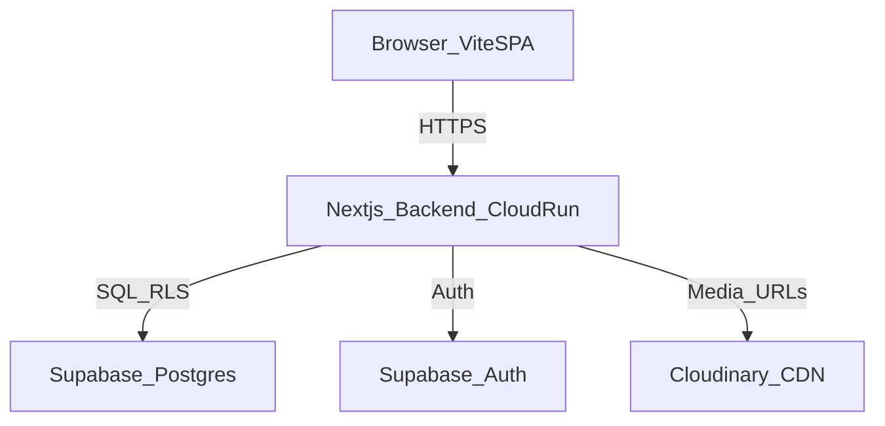

# BACKEND MASTER PLAN — SmolyanKlima

Този документ е **единственият източник на истина** за изграждането на:
- backend приложение в `backend/`
- Supabase база данни (Free plan) + сигурност (RLS)
- Admin панел (UI) + Admin API
- Public API за текущия Vite SPA frontend
- миграция от текущите hardcoded данни (`frontend/data/*`) към Supabase
- deploy на **Google Cloud Run (Docker)**

## 0) Контекст (какво имаме сега)
- **Frontend**: Vite + React SPA с `react-router-dom` (routes в `frontend/App.tsx`).
- **Данни**: в момента са **локални TypeScript модули**:
  - продукти/FAQ/отзиви/услуги: `frontend/data/db.ts`
  - слой за достъп до продукти (граница към бъдещ backend): `frontend/data/productService.ts`
  - блог статии: `frontend/data/blog/*` (вкл. `posts/*.ts`)
- **AI**: Gemini (клиент/промпт/guard) е във `frontend/components/ai-assistant/*`.

Целта е frontend-ът да мине на реални API-та, **без да пренаписваме UI** — само сменяме “service boundary”-тата.

---

## 0.1 “Field Audit” (изведено от реалния frontend код)
Това е минималният списък от данни/полета, които backend+DB трябва да покрият, защото вече се използват или са очевидно планирани:

### 0.1.1 Product (какво UI реално ползва)
`frontend/data/types/product.ts` дефинира два слоя:
- `DbProduct` (raw)
- `CatalogProduct` (card-ready за UI)

**Поля, които UI показва/филтрира/сравнява** (директно или индиректно):
- identity: `id` (slug в URL), `name`, `brand`, `type`, `category`
- specs: `area`, `energyCool`, `energyHeat`, `noise`, `coolingPower`, `heatingPower`, `refrigerant`, `wifi`, `warranty`, `description`, `features[]`
- pricing: `price`, `priceWithMount`
- social proof: `rating`, `reviews`
- merchandising: `is_featured`, `is_active`, `badge?`, `inStock` (в момента временно)

**Важно**: сега част от тези полета са derived/placeholder (image pool, badge logic, fake rating, inStock=true). Backend трябва да може да ги даде като **реални** данни или да ги остави derived във frontend (по избор).

### 0.1.2 Blog Article (какво реално се използва)
`frontend/data/blog/types.ts` реално изисква:
- базови: `id`, `slug`, `title`, `excerpt`, `content`, `category`, `tags[]`, `author`, `featuredImage`, `images?`
- SEO: `seo{title,description,keywords[],ogImage}`
- schema: `schema{headline,description,image[],datePublished,dateModified,author{name,url}}`
- метрики/дати: `publishedAt`, `modifiedAt`, `readingTime`, `viewCount`, `featured?`

### 0.1.3 Leads / inquiries (какви форми има)
- QuickView (каталог): `name`, `phone`, + свързан продукт (`productName` днес)
- ContactSection: `name`, `phone`, `service` (Продажба/Монтаж/Профилактика/Ремонт), `message?`
- Newsletter: `email`

### 0.1.4 localStorage (какво вече се пази на клиента)
- `sk_favorites`: `string[]` (product ids)
- `sk_recently_viewed`: `string[]` (product ids, last 4)
- AI assistant: `ai_chat_*` keys (messages/conversation/user context) + `ai_user_context`

---

## 1) Избор на технология (препоръка)
### Препоръчано: Next.js 15 (App Router) + Supabase (Free) + Cloud Run
**Защо това е най-доброто за твоя случай (API + Admin UI):**
- **Един codebase**: API routes + Admin UI в `backend/`.
- **Минимален код за максимален резултат**: auth, routing, server rendering за админа.
- **Cloud Run**: production Docker deployment, контрол над runtime-а.
- **Supabase**: Postgres + Auth + RLS (много силен security модел).

### Алтернативи (само ако има причина)
- **NestJS (Node) + отделен Admin SPA**: по-голяма сложност/повече код, не печелим много на този етап.
- **Headless CMS (Directus/Strapi)**: бърз старт за content, но добавя инфраструктура/поддръжка; не е “минимален код”.

**Заключение**: оставаш на **Next.js 15 в `backend/`** + **Supabase Free**.

---

## 2) Архитектура: Frontend ↔ Backend ↔ Supabase



### 2.1 Основен принцип
- **Public клиентът (frontend)** никога не говори директно със Supabase.
- **Всичко минава през backend API**, който прилага:
  - валидиране (Zod)
  - rate-limit (за публични endpoints)
  - auth/role проверки (за admin endpoints)
  - стабилен contract за frontend

---

## 3) Backend: структура на папките (целеви резултат)

`backend/`
- `app/`
  - `api/`
    - `products/route.ts`
    - `products/[slug]/route.ts`
    - `categories/route.ts`
    - `brands/route.ts`
    - `articles/route.ts`
    - `articles/[slug]/route.ts`
    - `inquiries/route.ts`
    - `admin/` (protected)
      - `products/*`
      - `articles/*`
      - `inquiries/*`
      - `settings/*`
  - `admin/` (Admin UI)
    - `layout.tsx`
    - `page.tsx` (dashboard)
    - `products/*`
    - `articles/*`
    - `inquiries/*`
    - `settings/*`
  - `login/page.tsx`
- `lib/`
  - `supabase/` (server client + auth helpers)
  - `db/` (query слой / repositories)
  - `validators/` (Zod schemas)
  - `rate-limit/`
  - `security/` (role checks, audit helpers)
- `types/` (DTO types)
- `scripts/` (import/seed/migrations helpers)
- `middleware.ts` (защита на `/admin/*` и `/api/admin/*`)
- `Dockerfile`
- `.env.example`

---

## 4) API контракт (Public + Admin)

### 4.1 Public API (за Vite SPA)
Минимални endpoints, които покриват сегашния frontend:
- `GET /api/products`
  - query params: `search`, `brands[]`, `types[]`, `energyClasses[]`, `features[]`, `priceMin`, `priceMax`, `sortBy`, `page`, `perPage`
- `GET /api/products/[slug]`
- `GET /api/categories`
- `GET /api/brands`
- `POST /api/inquiries`
- `POST /api/newsletter/subscribe` (email)
- `GET /api/articles` (само публикувани)
- `GET /api/articles/[slug]` (само публикувани)

### 4.2 Admin API (за Admin UI)
Protected (Supabase Auth + роли + RLS):
- `GET/POST/PUT/DELETE /api/admin/products`
- `GET/POST/PUT/DELETE /api/admin/articles`
- `GET/PATCH /api/admin/inquiries`
- `GET/PUT /api/admin/settings`
- `GET /api/admin/activity` (по избор)

### 4.3 Ключово изискване: 1:1 филтри/сортиране
Backend филтрите трябва да съответстват на текущите опции от `frontend/data/productService.ts`:
- sort: `recommended | price-asc | price-desc | energy-class | noise-asc | rating-desc`
- filters: brand/type/energy/features/price range

### 4.4 Мапинг на URL query params (как е във frontend сега)
От `frontend/pages/CatalogPage.tsx`:
- `q`: search string
- `cat`: category id (например `all`, `wall`, `multi` и т.н. — мапва се към `types[]` чрез `CATEGORIES`)
- `b`: brands (comma-separated)
- `e`: energy classes (comma-separated)
- `f`: features (comma-separated)
- `min` / `max`: price range
- `s`: sort option

Backend трябва да поддържа **същите семантики**, за да може frontend да остане минимално променен.

---

## 5) Supabase (Postgres) — точна схема (Free tier, production-ready)

### 5.1 Нотации и конвенции
- Всички таблици: `id uuid primary key default gen_random_uuid()`
- `created_at timestamptz default now()`
- `updated_at timestamptz default now()` + trigger за auto-update
- Slugs: `text unique not null` (lowercase, url-safe)

### 5.2 Таблици (MVP)
#### 5.2.1 Auth/админ
- `admin_users`
  - `id uuid primary key` (същото като `auth.users.id`)
  - `email text unique not null`
  - `name text not null`
  - `role text not null` (`super_admin | admin | editor | viewer`)
  - `is_active boolean default true`
  - `created_at`, `updated_at`, `last_login_at`

#### 5.2.2 Каталог
- `brands`
  - `id`, `slug`, `name`, `color`, `logo_url`, `website`, `is_active`, timestamps
- `categories` (продуктови категории/групи за UI — еквивалент на `CATEGORIES` от `frontend/data/productService.ts`)
  - `id`, `slug`, `name`, `description`, `icon`, `accent_color`, `sort_order`, `is_active`, timestamps
- `category_types` (много-към-много: кои `product.type` стойности влизат в коя категория)
  - `category_id uuid references categories(id)`
  - `product_type text not null`
  - primary key `(category_id, product_type)`

##### 5.2.2.1 Нормализиран модел (препоръчано за скорост/качество)
Това премахва substring filtering и неструктурни “text” полета, които са трудни за търсене/сравнение.

- `product_types`
  - `id`
  - `name text unique not null` (пример: `Стенен климатик`, `Мулти-сплит система`, ...)

- `products` (identity + pricing + flags)
  - `id`
  - `slug text unique not null` (еквивалент на текущото `CatalogProduct.id` в URL)
  - `name text not null`
  - `brand_id uuid not null references brands(id)`
  - `type_id uuid not null references product_types(id)`
  - `category_id uuid null references categories(id)` (UI facet; може да е null ако се определя само чрез `category_types`)
  - `description text`
  - `price numeric(10,2) not null`
  - `price_with_mount numeric(10,2)`
  - `old_price numeric(10,2)` (за бъдещи промоции; AI assistant model има `oldPrice?`)
  - `is_active boolean default true`
  - `is_featured boolean default false`
  - `stock_status text default 'in_stock'` (enum-like)
  - `stock_quantity int default 0`
  - `rating numeric(2,1) default 0`
  - `reviews_count int default 0`
  - SEO: `meta_title text`, `meta_description text`
  - timestamps

- `product_specs` (typed колони за сравнения/филтри)
  - `product_id uuid primary key references products(id) on delete cascade`
  - `coverage_m2 numeric(6,2)` (вместо `area: 'до 25 м²'` — backend може да генерира и display string)
  - `noise_db numeric(5,2)`
  - `cooling_power_kw numeric(6,2)`
  - `heating_power_kw numeric(6,2)`
  - `refrigerant text`
  - `wifi boolean`
  - `energy_class_cool text` (A+++, A++, A+, A, B...)
  - `energy_class_heat text`
  - (по избор) `seer numeric(6,2)`, `scop numeric(6,2)` (AI assistant skills ги използват/предвиждат)
  - `warranty_months int` (вместо свободен текст)

- `features`
  - `id`
  - `slug text unique not null`
  - `name text not null`

- `product_features`
  - `product_id uuid references products(id) on delete cascade`
  - `feature_id uuid references features(id) on delete cascade`
  - primary key `(product_id, feature_id)`

- `product_images`
  - `id`
  - `product_id uuid not null references products(id) on delete cascade`
  - `url text not null`
  - `sort_order int default 0`
  - `is_main boolean default false`

##### 5.2.2.2 Дисплей “compatibility layer” към текущия frontend
Текущият UI очаква `CatalogProduct` с fields като `energyClass`, `area`, `noise`, `coolingPower` като strings.
Backend трябва да връща **и двете**:
- “typed” fields за филтри/сортиране
- “display” fields (string), така че UI да не се пренаписва масово

Пример:
- `coverage_m2` (typed) + `area_display` (например `до 25 м²`)
- `noise_db` (typed) + `noise_display` (например `19 dB`)

#### 5.2.3 Блог
 
- `articles`
  - Базови:
    - `id`
    - `slug text unique not null`
    - `title text not null`
    - `excerpt text`
    - `content text not null` (markdown)
  - Класификация:
    - `category_slug text not null` (съвпада с frontend `Article.category`)
    - `tags text[] not null default '{}'` (съвпада с `Article.tags`)
    - `author_slug text not null` (съвпада с `Article.author`)
  - Медия:
    - `featured_image text not null` (съвпада с `Article.featuredImage`)
    - `images text[]` (съвпада с `Article.images?`)
  - SEO / Schema:
    - `seo jsonb not null` (title, description, keywords[], ogImage)
    - `schema jsonb not null` (headline, description, image[], datePublished/Modified, author{name,url})
  - Публикуване и метрики:
    - `is_published boolean default false`
    - `published_at timestamptz`
    - `modified_at timestamptz`
    - `reading_time int` (минути; съвпада с `Article.readingTime`)
    - `view_count int default 0`
    - `is_featured boolean default false` (съвпада с `Article.featured?`)
  - `created_at`, `updated_at`

##### 5.2.3.1 Нормализация на Blog (препоръчано за качество + консистентност)
В момента frontend държи author/category/tag като string-и и `tags: string[]`. За “световно ниво”:
- `blog_authors`
  - `id`
  - `slug text unique not null`
  - `name text not null`
  - `url text`
  - `bio text`
  - `avatar_url text`
  - timestamps

- `blog_categories`
  - `id`
  - `slug text unique not null`
  - `name text not null`
  - `description text`
  - `color text`
  - `is_active boolean default true`
  - timestamps

- `blog_tags`
  - `id`
  - `slug text unique not null`
  - `name text not null`
  - timestamps

- `blog_article_tags`
  - `article_id uuid references articles(id) on delete cascade`
  - `tag_id uuid references blog_tags(id) on delete cascade`
  - primary key `(article_id, tag_id)`

Тогава `articles` става:
- `author_id uuid references blog_authors(id)`
- `category_id uuid references blog_categories(id)`
и `tags` се четат през join (или материализиран изглед за бързина).

**Компромис (минимален код)**: остави `category_slug` + `author_slug` + `tags text[]` в `articles` за MVP и мигрирай към нормализация по-късно.

---

## 11) Supabase SQL (готови миграции)
Цел: да пуснеш това директно в Supabase SQL editor (на части) и да получиш production-ready DB: schema + индекси + RLS + тригери.

### 11.1 Extensions (нужни за perf/UX)

```sql
-- Enable useful extensions (run once)
create extension if not exists pgcrypto;
create extension if not exists citext;
create extension if not exists pg_trgm;
```

### 11.2 Base helpers: updated_at trigger

```sql
create or replace function public.set_updated_at()
returns trigger
language plpgsql
as $$
begin
  new.updated_at = now();
  return new;
end;
$$;
```

### 11.3 Tables (MVP)
#### admin_users + settings + activity_logs (липсващи за пълна админ функционалност)

```sql
create table if not exists public.admin_users (
  id uuid primary key, -- must match auth.users.id
  email citext unique not null,
  name text not null,
  role text not null default 'editor',
  is_active boolean not null default true,
  last_login_at timestamptz,
  created_at timestamptz not null default now(),
  updated_at timestamptz not null default now()
);

drop trigger if exists trg_admin_users_updated_at on public.admin_users;
create trigger trg_admin_users_updated_at
before update on public.admin_users
for each row execute function public.set_updated_at();

create table if not exists public.settings (
  key text primary key,
  value text,
  description text,
  updated_at timestamptz not null default now()
);

create table if not exists public.activity_logs (
  id uuid primary key default gen_random_uuid(),
  user_id uuid references public.admin_users(id),
  action text not null,
  entity_type text,
  entity_id uuid,
  details jsonb,
  created_at timestamptz not null default now()
);
```

#### brands

```sql
create table if not exists public.brands (
  id uuid primary key default gen_random_uuid(),
  slug text unique not null,
  name text not null,
  color text,
  logo_url text,
  website text,
  is_active boolean not null default true,
  created_at timestamptz not null default now(),
  updated_at timestamptz not null default now()
);

drop trigger if exists trg_brands_updated_at on public.brands;
create trigger trg_brands_updated_at
before update on public.brands
for each row execute function public.set_updated_at();
```

#### product_types

```sql
create table if not exists public.product_types (
  id uuid primary key default gen_random_uuid(),
  name text unique not null,
  created_at timestamptz not null default now(),
  updated_at timestamptz not null default now()
);

drop trigger if exists trg_product_types_updated_at on public.product_types;
create trigger trg_product_types_updated_at
before update on public.product_types
for each row execute function public.set_updated_at();
```

#### categories + category_types

```sql
create table if not exists public.categories (
  id uuid primary key default gen_random_uuid(),
  slug text unique not null,
  name text not null,
  description text,
  icon text,
  accent_color text,
  sort_order int not null default 0,
  is_active boolean not null default true,
  created_at timestamptz not null default now(),
  updated_at timestamptz not null default now()
);

drop trigger if exists trg_categories_updated_at on public.categories;
create trigger trg_categories_updated_at
before update on public.categories
for each row execute function public.set_updated_at();

create table if not exists public.category_types (
  category_id uuid not null references public.categories(id) on delete cascade,
  product_type text not null,
  primary key (category_id, product_type)
);
```

#### products + product_specs + features + product_features + product_images

```sql
create table if not exists public.products (
  id uuid primary key default gen_random_uuid(),
  slug text unique not null,
  name text not null,
  brand_id uuid not null references public.brands(id),
  type_id uuid not null references public.product_types(id),
  category_id uuid references public.categories(id),
  description text,
  price numeric(10,2) not null,
  price_with_mount numeric(10,2),
  old_price numeric(10,2),
  is_active boolean not null default true,
  is_featured boolean not null default false,
  stock_status text not null default 'in_stock',
  stock_quantity int not null default 0,
  rating numeric(2,1) not null default 0,
  reviews_count int not null default 0,
  meta_title text,
  meta_description text,
  created_at timestamptz not null default now(),
  updated_at timestamptz not null default now()
);

drop trigger if exists trg_products_updated_at on public.products;
create trigger trg_products_updated_at
before update on public.products
for each row execute function public.set_updated_at();

create table if not exists public.product_specs (
  product_id uuid primary key references public.products(id) on delete cascade,
  coverage_m2 numeric(6,2),
  noise_db numeric(5,2),
  cooling_power_kw numeric(6,2),
  heating_power_kw numeric(6,2),
  refrigerant text,
  wifi boolean,
  energy_class_cool text,
  energy_class_heat text,
  seer numeric(6,2),
  scop numeric(6,2),
  warranty_months int
);

create table if not exists public.features (
  id uuid primary key default gen_random_uuid(),
  slug text unique not null,
  name text not null,
  created_at timestamptz not null default now(),
  updated_at timestamptz not null default now()
);

drop trigger if exists trg_features_updated_at on public.features;
create trigger trg_features_updated_at
before update on public.features
for each row execute function public.set_updated_at();

create table if not exists public.product_features (
  product_id uuid not null references public.products(id) on delete cascade,
  feature_id uuid not null references public.features(id) on delete cascade,
  primary key (product_id, feature_id)
);

create table if not exists public.product_images (
  id uuid primary key default gen_random_uuid(),
  product_id uuid not null references public.products(id) on delete cascade,
  url text not null,
  sort_order int not null default 0,
  is_main boolean not null default false,
  created_at timestamptz not null default now()
);
```

#### articles (MVP, denormalized)

```sql
create table if not exists public.articles (
  id uuid primary key default gen_random_uuid(),
  slug text unique not null,
  title text not null,
  excerpt text,
  content text not null,
  category_slug text not null,
  tags text[] not null default '{}',
  author_slug text not null,
  featured_image text not null,
  images text[],
  seo jsonb not null,
  schema jsonb not null,
  is_published boolean not null default false,
  published_at timestamptz,
  modified_at timestamptz,
  reading_time int,
  view_count int not null default 0,
  is_featured boolean not null default false,
  created_at timestamptz not null default now(),
  updated_at timestamptz not null default now()
);

drop trigger if exists trg_articles_updated_at on public.articles;
create trigger trg_articles_updated_at
before update on public.articles
for each row execute function public.set_updated_at();
```

#### inquiries

```sql
create table if not exists public.inquiries (
  id uuid primary key default gen_random_uuid(),
  source text not null,
  customer_name text not null,
  customer_phone text not null,
  customer_email text,
  message text,
  product_id uuid references public.products(id),
  service_type text,
  status text not null default 'new',
  priority text not null default 'medium',
  assigned_to uuid,
  created_at timestamptz not null default now(),
  updated_at timestamptz not null default now()
);

drop trigger if exists trg_inquiries_updated_at on public.inquiries;
create trigger trg_inquiries_updated_at
before update on public.inquiries
for each row execute function public.set_updated_at();
```

#### newsletter_subscribers

```sql
create table if not exists public.newsletter_subscribers (
  id uuid primary key default gen_random_uuid(),
  email citext unique not null,
  source text not null default 'blog_newsletter',
  status text not null default 'active',
  subscribed_at timestamptz not null default now(),
  unsubscribed_at timestamptz
);
```

### 11.4 Indexes (performance)

```sql
-- products
create index if not exists idx_products_active_featured_price on public.products(is_active, is_featured, price);
create index if not exists idx_products_active_brand_price on public.products(is_active, brand_id, price);
create index if not exists idx_products_active_category_price on public.products(is_active, category_id, price);

-- articles
create index if not exists idx_articles_published_date on public.articles(is_published, published_at desc);

-- inquiries
create index if not exists idx_inquiries_status_created on public.inquiries(status, created_at desc);

-- admin_users
create index if not exists idx_admin_users_active on public.admin_users(is_active);
```

### 11.5 RLS policies (security)
Ниво: “public read / public insert / admin-only write”.

```sql
-- Enable RLS
alter table public.products enable row level security;
alter table public.articles enable row level security;
alter table public.inquiries enable row level security;
alter table public.admin_users enable row level security;
alter table public.settings enable row level security;
alter table public.activity_logs enable row level security;

-- Public read
drop policy if exists "products_public_read" on public.products;
create policy "products_public_read"
on public.products for select
using (is_active = true);

drop policy if exists "articles_public_read" on public.articles;
create policy "articles_public_read"
on public.articles for select
using (is_published = true);

-- Public insert inquiries (write via backend is recommended, but this keeps DB future-proof)
drop policy if exists "inquiries_public_insert" on public.inquiries;
create policy "inquiries_public_insert"
on public.inquiries for insert
with check (true);
```

### 11.6 Admin-only access (RLS helper + policies)
Цел: всички write операции по бизнес таблици да са позволени само за активни админи.

```sql
create or replace function public.is_active_admin()
returns boolean
language sql
stable
as $$
  select exists (
    select 1 from public.admin_users au
    where au.id = auth.uid()
      and au.is_active = true
  );
$$;

-- Products admin write
drop policy if exists "products_admin_write" on public.products;
create policy "products_admin_write"
on public.products for all
using (public.is_active_admin())
with check (public.is_active_admin());

-- Articles admin write
drop policy if exists "articles_admin_write" on public.articles;
create policy "articles_admin_write"
on public.articles for all
using (public.is_active_admin())
with check (public.is_active_admin());

-- Inquiries admin read/update
drop policy if exists "inquiries_admin_read" on public.inquiries;
create policy "inquiries_admin_read"
on public.inquiries for select
using (public.is_active_admin());

drop policy if exists "inquiries_admin_update" on public.inquiries;
create policy "inquiries_admin_update"
on public.inquiries for update
using (public.is_active_admin())
with check (public.is_active_admin());

-- Admin-only tables
drop policy if exists "admin_users_admin_read" on public.admin_users;
create policy "admin_users_admin_read"
on public.admin_users for select
using (public.is_active_admin());

drop policy if exists "admin_users_admin_write" on public.admin_users;
create policy "admin_users_admin_write"
on public.admin_users for all
using (public.is_active_admin())
with check (public.is_active_admin());

drop policy if exists "settings_admin_rw" on public.settings;
create policy "settings_admin_rw"
on public.settings for all
using (public.is_active_admin())
with check (public.is_active_admin());

drop policy if exists "activity_logs_admin_read" on public.activity_logs;
create policy "activity_logs_admin_read"
on public.activity_logs for select
using (public.is_active_admin());
```

### 11.7 Data quality constraints (професионално ниво)
За да няма “мръсни” данни и да са бързи филтрите, добави check constraints:
- `price >= 0`, `old_price is null or old_price >= price`
- `stock_quantity >= 0`
- валидни `energy_class_*` стойности (`A+++`, `A++`, `A+`, `A`, `B`, ...)
- `noise_db` и мощности да са >= 0

Пример:

```sql
alter table public.products
  add constraint chk_products_price_nonneg check (price >= 0),
  add constraint chk_products_stock_nonneg check (stock_quantity >= 0),
  add constraint chk_products_old_price check (old_price is null or old_price >= price);
```

### 11.8 Full-text search (FTS) + fuzzy search (trgm) — “световно ниво” търсене
Цел: бързо и качествено търсене по продукти и статии (вкл. правописни грешки/частични съвпадения), без да товарим backend-а.

#### 11.8.1 Products search index (name + description)
Поддържа:
- FTS: `to_tsvector(...) @@ plainto_tsquery(...)`
- fuzzy/partial: `name % 'daikn'` / `similarity(name,'...')`

```sql
-- FTS index
create index if not exists idx_products_fts
on public.products
using gin (to_tsvector('simple', coalesce(name,'') || ' ' || coalesce(description,'')));

-- trigram index (for ILIKE / similarity)
create index if not exists idx_products_name_trgm
on public.products
using gin (name gin_trgm_ops);
```

#### 11.8.2 Articles search index (title + excerpt + content)

```sql
create index if not exists idx_articles_fts
on public.articles
using gin (to_tsvector('simple', coalesce(title,'') || ' ' || coalesce(excerpt,'') || ' ' || coalesce(content,'')));

create index if not exists idx_articles_title_trgm
on public.articles
using gin (title gin_trgm_ops);
```

#### 11.8.3 Query pattern (backend)
Backend комбинира:
- FTS за “точни/релевантни” резултати
- trgm за tolerant matching (опционално, ако FTS върне малко)

```sql
-- example: products search (public)
select p.*
from public.products p
where p.is_active = true
  and to_tsvector('simple', coalesce(p.name,'') || ' ' || coalesce(p.description,'')) @@ plainto_tsquery('simple', $1)
order by p.is_featured desc, p.price asc
limit $2 offset $3;
```

---

## 12) Notifications (email) за запитвания и newsletter
Цел: когато има ново `inquiries`/newsletter subscribe — да получаваш email веднага (и/или да има автоматичен отговор към клиента).

### 12.1 Препоръчано (минимален код, стабилно): Resend API
- Най-бързият начин за надеждна deliverability + лесен DX.
- Работи добре на Cloud Run (HTTP API call).

**Env vars (backend):**
- `RESEND_API_KEY`
- `NOTIFY_EMAIL_TO` (пример: `office@smolyanklima.bg`)
- `NOTIFY_EMAIL_FROM` (пример: `no-reply@smolyanklima.bg`)

**Поведение:**
- `POST /api/inquiries`:
  - запис в DB
  - изпрати notify email към `NOTIFY_EMAIL_TO` (с данните на клиента + продукт ако има)
  - (по избор) изпрати confirmation email към клиента ако има `customer_email`
- `POST /api/newsletter/subscribe`:
  - upsert subscriber
  - (по избор) double opt-in: `status='pending'` + token + confirm endpoint

### 12.2 Anti-spam + reliability
- Rate limiting (IP + phone/email)
- Honeypot поле в формите
- Retry стратегия (ако email provider падне):
  - MVP: лог в `activity_logs` + повторен опит от admin UI бутон “Resend”
  - Pro: таблица `email_outbox` (queue) + background worker (Cloud Run job/cron)

### 12.3 (По избор) SMS / Viber
Ако искаш “световно ниво” response time: интеграция с SMS provider (Twilio/MessageBird) — но това е след MVP.

---

## 13) Newsletter double opt-in + email outbox (за 100% надеждност)
Това е силно препоръчано, ако искаш висок deliverability и минимални spam оплаквания.

### 13.1 Таблици

#### 13.1.1 newsletter_subscribers (разширение)
- добавяме `status` стойности: `pending | active | unsubscribed`
- добавяме `confirm_token_hash` + `confirm_sent_at` + `confirmed_at`

```sql
alter table public.newsletter_subscribers
  add column if not exists status text not null default 'pending',
  add column if not exists confirm_token_hash text,
  add column if not exists confirm_sent_at timestamptz,
  add column if not exists confirmed_at timestamptz;

-- ако вече имаш legacy 'active', можеш да мигрираш:
-- update public.newsletter_subscribers set status='active' where status='active';
```

#### 13.1.2 email_outbox (queue)
Използва се когато:
- email provider е down
- искаш retry
- искаш централизирано логване/trace на нотификациите

```sql
create table if not exists public.email_outbox (
  id uuid primary key default gen_random_uuid(),
  kind text not null, -- inquiry_notify | inquiry_confirm | newsletter_confirm | newsletter_welcome
  to_email citext not null,
  from_email citext,
  subject text not null,
  html text not null,
  text text,
  status text not null default 'pending', -- pending | sent | failed
  attempts int not null default 0,
  last_error text,
  send_after timestamptz not null default now(),
  created_at timestamptz not null default now(),
  sent_at timestamptz
);

create index if not exists idx_email_outbox_pending on public.email_outbox(status, send_after asc);
```

### 13.2 Endpoints (backend)
- `POST /api/newsletter/subscribe`
  - upsert subscriber
  - генерира token, пази **hash** в DB
  - enqueue email `newsletter_confirm` в `email_outbox`
- `GET /api/newsletter/confirm?token=...`
  - валидира hash
  - set `status='active'`, `confirmed_at=now()`
  - enqueue welcome email (по избор)

### 13.3 Worker стратегия (Cloud Run)
MVP варианти:
- **Вариант A (най-лесен)**: on-request изпращане + ако fail → запис в `email_outbox` и retry от admin UI бутон
- **Вариант B (най-надежден)**: Cloud Run Job / Cloud Scheduler (на 1-5 мин) изпълнява `/api/admin/email-outbox/drain`

### 13.4 RLS
`email_outbox` трябва да е **admin-only** (или само service role).

```sql
alter table public.email_outbox enable row level security;
drop policy if exists "email_outbox_admin_rw" on public.email_outbox;
create policy "email_outbox_admin_rw"
on public.email_outbox for all
using (public.is_active_admin())
with check (public.is_active_admin());
```

#### 5.2.4 Запитвания (leads)
- `inquiries`
  - `id`
  - `source text` (`contact | product | wizard | quick_view | ai`)
  - `customer_name text not null`
  - `customer_phone text not null`
  - `customer_email text`
  - `message text`
  - `product_id uuid null references products(id)`
  - `service_type text null` (`sale | installation | maintenance | repair`) — покрива ContactSection радиото
  - `status text default 'new'` (`new | contacted | quoted | converted | lost`)
  - `priority text default 'medium'`
  - `assigned_to uuid null references admin_users(id)`
  - timestamps

#### 5.2.4.1 Newsletter (реално ползвано във frontend, но без backend)
В момента `frontend/components/blog/NewsletterSection.tsx` симулира API call и има **само поле `email`**.
- `newsletter_subscribers`
  - `id`
  - `email citext unique not null`
  - `source text` (`blog_newsletter`)
  - `status text default 'active'` (`active | unsubscribed`)
  - `subscribed_at timestamptz default now()`
  - `unsubscribed_at timestamptz`

#### 5.2.4.2 Contact request (реално ползвано във frontend, но без backend)
`frontend/components/sections/ContactSection.tsx` има: **name**, **phone**, **service**, **message?**.
Имаме два чисти варианта:
- **Вариант A (минимален код)**: всичко влиза в `inquiries` (с `source='contact'` + `service_type`)
- **Вариант B (по-строга нормализация)**: отделна таблица `contact_requests`

Препоръка: **Вариант A** (в `inquiries`) + добавяме полета:
- `service_type text null` (`sale | installation | maintenance | repair`)
- `utm_source/utm_medium/utm_campaign text null` (за маркетинг)

#### 5.2.5 Настройки и audit
- `settings` (`key text primary key`, `value text`, `description text`)
- `activity_logs` (`id`, `user_id`, `action`, `entity_type`, `entity_id`, `details jsonb`, `created_at`)

#### 5.2.6 (по избор, но препоръчано) User-facing данни, които вече се пазят в localStorage
Frontend вече пази в localStorage:
- favorites: `sk_favorites` (array от product ids/slugs)
- recently viewed: `sk_recently_viewed` (array от product ids/slugs; top N)

Ако искаш “световно ниво” UX (cross-device + analytics), добавяме:
- `customer_sessions` (анонимна сесия)
  - `id uuid primary key default gen_random_uuid()`
  - `first_seen_at`, `last_seen_at`
  - `user_agent text`, `ip_hash text` (по избор, GDPR-внимателно)
- `favorites`
  - `id`
  - `session_id uuid references customer_sessions(id)`
  - `product_id uuid references products(id)`
  - `created_at`
  - unique `(session_id, product_id)`
- `recently_viewed`
  - `id`
  - `session_id uuid references customer_sessions(id)`
  - `product_id uuid references products(id)`
  - `viewed_at`
  - index `(session_id, viewed_at desc)`

#### 5.2.7 (по избор) AI telemetry / errors (за “световно ниво” мониторинг)
Frontend dispatch-ва CustomEvent-и като `ai:error`, `ai:trackProductView`, `ai:trackSearch`, `ai:trackPageContext` (виж `frontend/components/ai-assistant/hooks/useAIIntegration.ts` и `ui/ErrorBoundary.tsx`).
Ако искаш тези данни да се събират централно:
- `ai_events`
  - `id`
  - `session_id uuid null references customer_sessions(id)`
  - `event_type text not null` (например `error|trackProductView|trackSearch|trackPageContext|socialProof|suggestChat`)
  - `payload jsonb not null`
  - `created_at`
  - indexes: `(event_type, created_at desc)`, `(session_id, created_at desc)`

#### 5.2.8 (по избор) AI conversations (ако решиш да не са само localStorage)
Frontend вече има структури `ai_chat_messages_v2`, `ai_chat_conversation_v2`, `ai_chat_user_context_v2`.
Ако ги преместим в backend:
- `ai_conversations`: `id`, `session_id`, `created_at`, `updated_at`, `consent_version`, `channel` (`widget`)
- `ai_messages`: `id`, `conversation_id`, `role`, `content`, `created_at`, `metadata jsonb`
- `ai_user_context`: `session_id`, `context jsonb`, `updated_at`

### 5.3 Индекси (минимум)
- Unique: `products.slug`, `articles.slug`, `brands.slug`, `categories.slug`
- Filtering:
  - `products(brand_id)`, `products(category_id)`, `products(price)`, `products(is_active)`, `products(is_featured)`
  - `articles(is_published, published_at)`
  - `inquiries(status, created_at)`

### 5.3.1 Индекси за оптимизация и скорост (препоръчани)
- `products`:
  - composite: `(is_active, is_featured, price)` за “featured + price” списъци
  - composite: `(is_active, brand_id, price)` за brand filtering + price range
  - composite: `(is_active, category_id, price)` ако category стане реална филтрация
  - `GIN(features)` ако ще филтрираш по features често
  - (по избор) FTS: `GIN(to_tsvector('simple', name || ' ' || coalesce(description,'')))` за search
- `articles`:
  - composite: `(is_published, published_at desc)`
  - (по избор) FTS: `GIN(to_tsvector('simple', title || ' ' || coalesce(excerpt,'') || ' ' || coalesce(content,'')))`
### 5.4 RLS политики (MVP)
#### Public read
- `products`: `SELECT` само ако `is_active = true`
- `articles`: `SELECT` само ако `is_published = true`
#### Public write
- `inquiries`: `INSERT` позволен за всички (валидира се в backend), `SELECT/UPDATE` само за админи
#### Admin
- Всички `INSERT/UPDATE/DELETE` за каталога/блога: позволени само ако `auth.uid()` е активен админ в `admin_users`.
### 5.5 Тригери
- `updated_at` trigger за: `products, brands, categories, articles, inquiries, admin_users`
---

## 6) Admin UI (Next.js) — функционален обхват
### MVP екрани
- **Login** (Supabase Auth)
- **Dashboard**: брой продукти, публикувани статии, нови запитвания
- **Products CRUD**: list + filters + create/edit + images + featured/active toggle
- **Articles CRUD**: markdown editor + publish toggle + SEO fields
- **Inquiries CRM**: list + status change + assign + notes
- **Settings**: контакти, работно време, базови цени/текстове
### Защита
- `middleware.ts` пази `/admin/*` и `/api/admin/*`
- RLS гарантира, че дори при bypass на UI няма write без админ.
---

## 7) Миграция от текущия frontend към Supabase
### 7.1 Продукти
Източник: `frontend/data/db.ts`

План:
- import скрипт в `backend/scripts/import-products.ts`
- map на полетата:
  - `db.ts.products[].id` → `products.slug`
  - `name/brand/type/category/area/energyCool/...` → съответните колони
  - `features[]` → `products.features`
  - `price` → `products.price`
- images:
  - първа версия: използвай текущите изображения от `public/images/*` или Cloudinary URLs

### 7.2 Блог
Източник: `frontend/data/blog/posts/*.ts`

План:
- import скрипт `backend/scripts/import-articles.ts`
- `content` остава markdown

### 7.3 Запитвания
- нови записи от frontend форми → `POST /api/inquiries`
---

## 8) Пренасочване на frontend-а към backend API (без пренаписване на UI)
### 8.1 Каталог
- **Запазваме** публичния интерфейс на `frontend/data/productService.ts`
- Сменяме реализацията му от локални данни към `fetch(backend)`
- UI компонентите остават непроменени.

### 8.2 Блог
- Аналогично: data helpers да четат от `/api/articles` или остават локални до миграция.
---

## 9) Deployment: Cloud Run (Docker) + CI/CD
### 9.1 Docker
- multi-stage build за Next.js
- runtime env vars в Cloud Run

### 9.2 GitHub Actions
- build image → push → deploy

### 9.3 Env vars (backend)
- `SUPABASE_URL`
- `SUPABASE_ANON_KEY`
- `SUPABASE_SERVICE_ROLE_KEY` (само backend)
- `CLOUDINARY_CLOUD_NAME`, `CLOUDINARY_API_KEY`, `CLOUDINARY_API_SECRET` (качване на изображения през `POST /api/admin/uploads/image`; в базата се пазят само `secure_url` линкове)
- `FRONTEND_ORIGIN` (CORS allowlist)
---

## 10) Етапи на изпълнение (чеклист)
### Фаза 0 — Точен “field audit” (задължително преди DB)
- Извличаме всички полета, които UI ползва (catalog/blog/AI/forms/localStorage).
- Заключваме contract-и за: Product, Article, Inquiry, Settings.
- Решаваме кои “derived” UI полета да се изчисляват в backend (или да останат derived във frontend).

### Фаза 1 — Supabase foundation (схема + RLS + индекси + тригери)
- SQL миграции за всички MVP таблици.
- RLS политики (public read, public insert, admin-only write).
- Индекси + FTS (където има реална нужда).
- Seed: първични brands/categories/settings.

### Фаза 2 — Public API (стабилен contract за SPA)
- `GET /api/products` с филтри/сортиране 1:1 спрямо текущия frontend query mapping.
- `GET /api/products/[slug]`
- `GET /api/articles` и `GET /api/articles/[slug]`
- `POST /api/inquiries` (и опционално `POST /api/newsletter/subscribe`)
- Rate limiting + валидиране (Zod) + spam защита (honeypot/recaptcha по избор).

### Фаза 3 — Admin Auth + Admin UI skeleton
- Supabase Auth (admin users).
- `middleware.ts` защита на `/admin/*` и `/api/admin/*`.
- Admin layout + navigation + първи екран Dashboard.

### Фаза 4 — Admin CRUD (пълна функционалност)
- Products CRUD + images + featured/active + stock.
- Articles CRUD (markdown) + publish + SEO.
- Inquiries CRM: list + status + assign + notes.
- Settings UI.

### Фаза 5 — Migration scripts + data import (от текущия frontend)
- Импорт на продукти от `frontend/data/db.ts`.
- Импорт на статии от `frontend/data/blog/posts/*.ts`.
- Идемпотентност (повторно пускане без дубли).

### Фаза 6 — Frontend switch (минимални промени)
- `frontend/data/productService.ts` се пренасочва към backend API.
- Blog helpers към API (или поетапно).
- LocalStorage системите остават, докато не добавиш session-based таблици.

### Фаза 7 — Deploy (Cloud Run) + hardening
- Docker multi-stage build за Next.js.
- CI/CD.
- CORS allowlist, security headers, audit logs.
- Smoke tests + мониторинг.

---

## Прогрес и лакуни (одит спрямо кода, 2026-04)

**Къде сме по фазите:** Фази **0–2** са в голямата си част покрити; **Фаза 3** е частично (UI + login); **Фаза 4** е в ход — има CRUD екрани и API, но не „пълна“ функционалност от чеклиста; **Фаза 5** — скриптове има; **Фаза 6** — каталог/блог към API са пренасочени; **Фаза 7** — почти незапочната. Съобщението в [`backend/app/admin/page.tsx`](backend/app/admin/page.tsx) („Фаза 3… Следва Фаза 4“) е **остаряло** спрямо реалното състояние — препоръчва се да се обнови на нещо от сорта: „Фаза 4 в прогрес / Фаза 5–7 частично“.

### Фаза 0 — Field audit
- **Статус:** покрито в този документ (§0.1) и в имплементацията на схемата/API.

### Фаза 1 — Supabase foundation
- **Налично:** миграции `0001`–`0013` (ядро, RLS, индекси, FTS+trgm в `0003`, seed, accessories, grants, inquiries notes, RPC търсене, admin write за specs/images и `product_features`).
- **Лакуни:** опционалните неща от плана (отделни публични таблици за favorites/sessions, `ai_events`) не са задължителни за MVP — липсват по избор.

### Фаза 2 — Public API
- **Налично:** `GET/POST` нужните ядра — `products`, `products/[slug]`, `articles`, `articles/[slug]`, `inquiries`, `newsletter/subscribe` + `confirm`, `health`, допълнително `accessories`, **`POST /api/ai/chat`**, **`GET /api/brands`**, **`GET /api/categories`** (с `product_types` по категория).
- **Подобрения (одит → код):** rate limit за `POST /api/inquiries` и `POST /api/newsletter/subscribe`; honeypot поле `website` в inquiries + newsletter; търсене в продукти чрез RPC `search_product_ids` (миграция `0011`) с **fallback** към `ilike`, ако RPC още не е приложен; филтрите по марка/категория/енергия/features са пренаписани с **реални id-та**, не счупени embed филтри в PostgREST.
- **Оставащи лакуни (по желание):** rate limit за `GET` каталог/статии; пълно FTS без fallback; reCAPTCHA; фронтендът може да премине от статични `CATEGORIES` към `GET /api/categories` (API вече съществува).

### Фаза 3 — Admin Auth + skeleton
- **Налично:** [`login/page.tsx`](backend/app/login/page.tsx) + server actions [`login/actions.ts`](backend/app/login/actions.ts); [`admin/layout.tsx`](backend/app/admin/layout.tsx) с навигация; dashboard страница (placeholder KPI „—“).
- **Next.js 16 / защита на админ:** в тази версия се използва **`proxy.ts`** (виж build: „ƒ Proxy (Middleware)“), а **не** `middleware.ts` — двата файла едновременно чупят build. Защитата на `/admin/*` и `/api/admin/*` е в [`backend/proxy.ts`](backend/proxy.ts) + `export const config.matcher`.

### Фаза 4 — Admin CRUD (пълен обхват от §6)
- **Продукти:** list + new + edit + DELETE; meta за марки/типове; **качване на снимки** в **Cloudinary** по папка `smolyanklima/klimatici/{slug}/` или `smolyanklima/aksesoari/{slug}/` ([`api/admin/uploads/image`](backend/app/api/admin/uploads/image/route.ts)); в Supabase само URL-и в `product_images`, **до 4** на продукт/аксесоар.
- **Статии:** new/edit с markdown, SEO, publish, featured; **една** основна снимка (`featured_image`, JSON-LD `schema.image` с един URL); допълнителна галерия в колона `images` не се ползва (`[]`). Качване: `smolyanklima/blog/{slug}/`.
- **Inquiries:** list + филтри + PATCH; **CRM бележки:** колона `admin_notes` (миграция `0010`), API `adminNotes`, UI модал „Бележки“ в админ списъка.
- **Settings:** UI + API за key/value — **има** (generic редове, не wizard за „работно време“ и т.н. от §6).
- **Dashboard:** реални броячи от Supabase + бутон за изпращане на **`email_outbox`** през [`POST /api/admin/email-outbox/drain`](backend/app/api/admin/email-outbox/drain/route.ts) (Resend).

### Фаза 5 — Import scripts
- **Налично:** [`scripts/import_products.ts`](backend/scripts/import_products.ts), [`scripts/import_blog.ts`](backend/scripts/import_blog.ts) + npm scripts в `package.json`.
- **Лакуна:** идемпотентност/документация за оператор (един източник на истина кога и как се пускат) може да се подобри; няма автоматичен тест на импорта в CI.

### Фаза 6 — Frontend switch
- **Налично:** [`productService.ts`](frontend/data/productService.ts) и [`blogService.ts`](frontend/data/blogService.ts) четат от `/api/*` (чрез Vite proxy).
- **AI:** [`useAIChat`](frontend/components/ai-assistant/hooks/useAIChat.ts) и [`ProductSearchSkill`](frontend/components/ai-assistant/skills/ProductSearchSkill.ts) зареждат продукти от **`getAllProducts()`** (API), чрез [`catalogToAIProducts.ts`](frontend/components/ai-assistant/data/catalogToAIProducts.ts). Каталогът използва `fetchProductsCatalogPage` и свързаните публични endpoints.

### Фаза 7 — Deploy + hardening
- **Добавено:** [`backend/Dockerfile`](backend/Dockerfile) (standalone), [`backend/.env.example`](backend/.env.example), [`.github/workflows/ci.yml`](.github/workflows/ci.yml). `next.config.mjs`: `output: "standalone"`.
- **Частично:** CORS allowlist; security headers/мониторинг/smoke — по избор.

### Резюме
След одит → имплементация: публични **brands/categories**, **продуктови филтри + търсене**, **rate limit + honeypot** (контакт + quick view → `POST /api/inquiries`), **CRM бележки + имейл notify (Resend)**, **dashboard + drain на опашката**, **Docker/CI**, **AI от API**, **Cloudinary за медия + линкове в Postgres**. Следващи стъпки по желание: security headers, smoke тестове, още server-side филтри за каталога.
